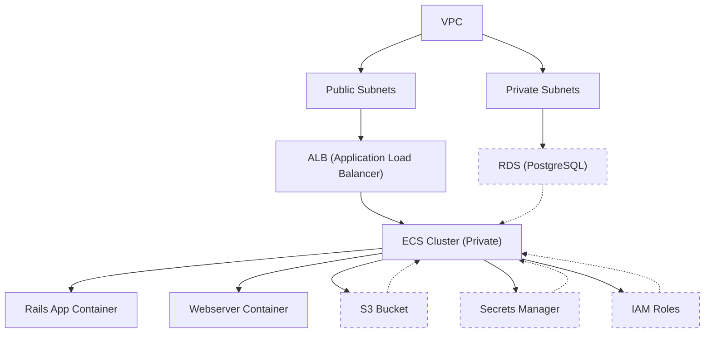

# ECR Hosting Terraform Infrastructure

This directory contains Terraform code to provision AWS infrastructure for a Ruby on Rails application using ECS, RDS, S3, ALB (ELB), IAM, VPC, and Secrets Manager.

---

## Folder Structure

```
.
├── main.tf
├── variables.tf
├── outputs.tf
├── providers.tf
├── terraform.tfvars
├── modules/
│   ├── vpc/
│   ├── s3/
│   ├── secrets_manager/
│   ├── iam/
│   ├── alb/
│   ├── ecs/
│   └── rds/
```

---

## Architecture Overview

The following diagram illustrates the AWS infrastructure provisioned by this Terraform module for a Ruby on Rails application. All resources are hosted in private subnets except the Application Load Balancer (ALB/ELB), which is public and distributes traffic to ECS services in private subnets. ECS tasks integrate with RDS (Postgres) and S3 using environment variables and IAM roles (no access keys).



**Key Points:**
- The ALB (ELB) is the only public-facing resource, routing traffic to ECS services in private subnets.
- ECS tasks run in private subnets and integrate with:
  - RDS (Postgres) using environment variables: `RDS_HOSTNAME`, `RDS_DB_NAME`, `RDS_USERNAME`, `RDS_PASSWORD`
  - S3 using IAM role authentication (no access keys in code)
- Secrets Manager stores sensitive values and injects them as environment variables into ECS tasks.

---

## Configuration

Before deploying the infrastructure, you must configure the `terraform.tfvars` file with your environment-specific values.

### Required Variables

Edit `terraform.tfvars` to set the following variables:

**VPC and Network Configuration:**
- `vpc_name`, `vpc_cidr`, `public_subnet_cidrs`, `private_subnet_cidrs`, `azs`

**Application Configuration:**
- `s3_bucket_name`, `secrets_map`, `iam_role_name`, `alb_name`, `ecs_name`
- `rails_app_container_name`, `webserver_container_name`, `rails_app_port`, `webserver_port`
- `cpu`, `memory`, `desired_count`, `environment`, `aws_region`

**Database Configuration:**
- `rds_name`, `db_username`, `db_password`, `db_name`, `db_port`, `db_engine_version`, `db_instance_class`, `db_allocated_storage`, `db_multi_az`

**General Configuration:**
- `tags`, `health_check_path`

### Example Configuration

```hcl
vpc_name = "mallow-prod-vpc"
vpc_cidr = "10.0.0.0/16"
public_subnet_cidrs = ["10.0.1.0/24", "10.0.2.0/24"]
private_subnet_cidrs = ["10.0.11.0/24", "10.0.12.0/24"]
azs = ["us-east-1a", "us-east-1b"]

s3_bucket_name = "mallow-prod-assets"
secrets_map = {
  RDS_DB_NAME = "railsdb"
  RDS_USERNAME = "railsuser"
  RDS_PASSWORD = "<secure-password>"
  RDS_HOSTNAME = "<to-be-populated-by-rds-endpoint>"
  RDS_PORT = "5432"
  S3_BUCKET_NAME = "mallow-prod-assets"
  S3_REGION_NAME = "us-east-1"
  LB_ENDPOINT = "<alb-endpoint>"
}

ecs_name = "mallow-prod-ecs"
cpu = 512
memory = 1024
desired_count = 2
aws_region = "us-east-1"

rds_name = "mallow-prod-db"
db_username = "railsuser"
db_password = "<secure-password>"
db_name = "railsdb"
db_port = 5432
db_engine_version = "14"
db_instance_class = "db.t3.micro"
db_allocated_storage = 20
db_multi_az = false

tags = {
  Environment = "prod"
  Project = "mallow"
}
```

**Important**: Never commit sensitive values to version control. All configuration should be set in `terraform.tfvars` and not hardcoded in the Terraform code or documentation. Use AWS Secrets Manager for all sensitive data.

---

## Security Features

- **Private Subnets:** All compute resources (ECS, RDS) are deployed in private subnets, inaccessible from the public internet.
- **Public Load Balancer Only:** Only the Application Load Balancer (ALB/ELB) is public-facing, minimizing the attack surface.
- **IAM Roles for S3 Access:** ECS tasks use IAM roles for S3 access, eliminating the need for static access keys and enforcing least privilege.
- **AWS Secrets Manager:** All sensitive data (database credentials, etc.) is stored in AWS Secrets Manager and injected as environment variables, never hardcoded.
- **No Hardcoded Credentials:** No secrets or sensitive values are present in the codebase or documentation.
- **Security Groups:** Fine-grained security groups restrict network access between resources (e.g., only ALB can reach ECS, only ECS can reach RDS).
- **Least Privilege Principle:** IAM roles and policies are scoped to the minimum permissions required for each service.
- **Tagging:** All resources are tagged for traceability and management.

---

## Deployment Process

1. Install Terraform (v1.0+ recommended)
2. Configure AWS credentials (via environment or AWS CLI)
3. Initialize Terraform:
   ```sh
   terraform init
   ```
4. Configure your environment in `terraform.tfvars`:
   - Set all required variables (see `variables.tf` for details)
   - Do not hardcode any values in the Terraform code or documentation.
5. Plan the deployment:
   ```sh
   terraform plan
   ```
6. Apply the configuration:
   ```sh
   terraform apply
   ```

---

## Outputs

After applying, Terraform will output:
- `vpc_id`, `public_subnet_ids`, `private_subnet_ids`
- `alb_dns_name` (ALB endpoint)
- `ecs_service_name`, `ecs_cluster_name`
- `rds_endpoint`
- `s3_bucket`
- `iam_role_arn`
- `secrets_arn`

---

## Security Notes

- Never commit secrets (passwords, keys) to version control.
- Use AWS Secrets Manager for all sensitive values.
- All resources except the ALB are private for security.
- S3 access is managed via IAM roles, not static credentials.

---

