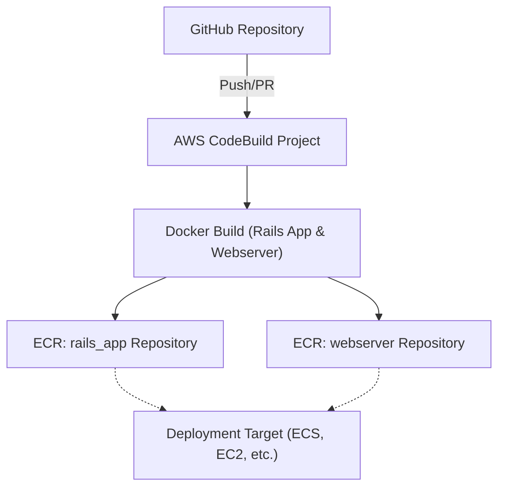

# ECR Terraform Infrastructure

This directory contains Terraform code to provision AWS infrastructure for a CI/CD pipeline using AWS ECR (Elastic Container Registry) and AWS CodeBuild for a Ruby on Rails application. The setup is modular, secure, and production-ready.

---

## Folder Structure

```
.
├── main.tf
├── providers.tf
├── ecr.tf
├── iam.tf
├── codebuild.tf
├── variables.tf
├── outputs.tf
├── terraform.tfvars
├── buildspec.yml
├── scripts/
│   └── buildspec.yml
└── README.md
```

---

## Architecture Overview

The following diagram illustrates the CI/CD pipeline infrastructure provisioned by this Terraform module. It automates Docker image builds and pushes to ECR using AWS CodeBuild, triggered by changes in a GitHub repository.



**Key Points:**
- CodeBuild pulls source from GitHub, builds Docker images, and pushes to ECR.
- ECR repositories store images for the Rails app and webserver (Nginx).
- IAM roles and policies restrict permissions to the minimum required.

---

## Configuration

Before deploying the infrastructure, you must configure the `terraform.tfvars` file with your environment-specific values.

### Required Variables

Edit `terraform.tfvars` to set the following variables:
- `aws_region` - Your AWS region (e.g., "us-east-1")
- `project_name` - Name for your project (used for resource naming)
- `ecr_rails_repository_name` - Name for the Rails app ECR repository
- `ecr_webserver_repository_name` - Name for the webserver ECR repository
- `github_repository_url` - URL of your GitHub repository
- `codebuild_compute_type` - CodeBuild compute type (e.g., "BUILD_GENERAL1_SMALL")
- `codebuild_timeout` - CodeBuild timeout in minutes

### Example Configuration

```hcl
aws_region = "us-east-1"
project_name = "rails-app"
ecr_rails_repository_name = "rails_app"
ecr_webserver_repository_name = "webserver"
github_repository_url = "https://github.com/your-username/your-repo.git"
codebuild_compute_type = "BUILD_GENERAL1_SMALL"
codebuild_timeout = 60
```

**Important**: Never commit sensitive values to version control. All configuration should be set in `terraform.tfvars` and not hardcoded in the Terraform code or documentation.

---

## Security Features

- **IAM Roles for CodeBuild:** CodeBuild uses a dedicated IAM role with least-privilege permissions for ECR and CloudWatch Logs.
- **ECR Image Scanning:** ECR repositories are configured to scan images on push for vulnerabilities.
- **ECR Encryption:** All ECR repositories use AES256 encryption for stored images.
- **No Hardcoded Credentials:** All sensitive values and configuration are set via `terraform.tfvars` and environment variables, not in code.
- **Tagging:** All resources can be tagged for traceability and management.

---

## Deployment Process

1. Install Terraform (v1.0+ recommended)
2. Configure AWS credentials (via environment or AWS CLI)
3. Initialize Terraform:
   ```sh
   terraform init
   ```
4. Configure your environment in `terraform.tfvars`:
   - Set all required variables (see `variables.tf` for details)
   - Do not hardcode any values in the Terraform code or documentation.
5. Plan the deployment:
   ```sh
   terraform plan
   ```
6. Apply the configuration:
   ```sh
   terraform apply
   ```
7. Trigger a build in AWS CodeBuild or via a GitHub webhook to build and push Docker images to ECR.

---

## Outputs

After applying, Terraform will output:
- `ecr_rails_repository_url` - URL of the Rails app ECR repository
- `ecr_webserver_repository_url` - URL of the webserver ECR repository
- `codebuild_project_name` - Name of the CodeBuild project
- `docker_login_command` - Command to authenticate Docker with ECR
- `manual_build_commands` - Helper commands for manual Docker build/tag/push

---

## License

MIT or your company license here. 